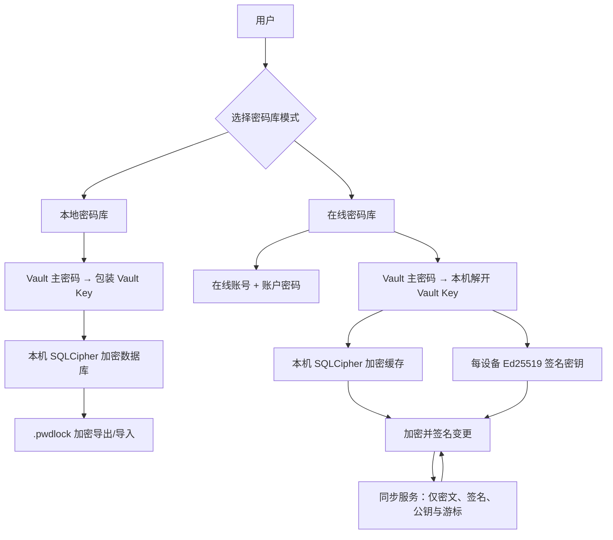
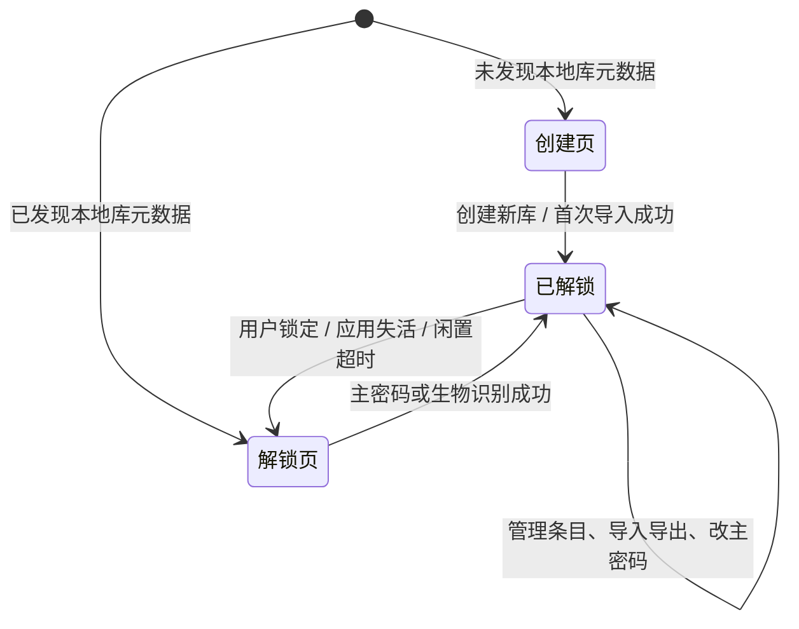
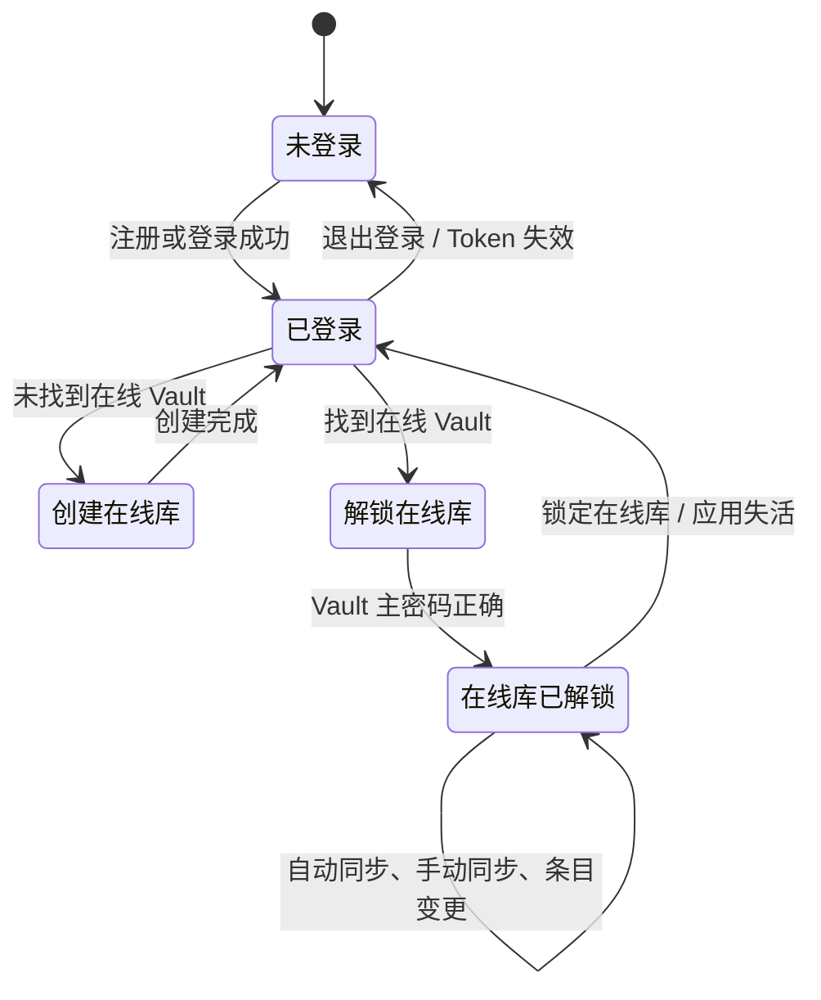

# Pwdlock 密码库产品功能设计

> 版本：1.0（以 macOS 当前实现为基线）
>
> 适用对象：Windows、Android 及后续客户端开发、测试、产品设计
>
> 状态：跨端 MVP 功能基线
> 最后更新：2026-07-18

## 1. 文档目的与使用方式

本文从 macOS 当前代码中提炼密码库的真实产品行为，供其他端实现同等能力时使用。它描述用户可见流程、状态、数据含义、安全边界和跨端一致性要求，而非某一平台的 UI 像素规范。

本产品有两种彼此独立的模式：

- **本地密码库**：数据只保留在当前设备的加密数据库中，借助用户主动导出的 `.pwdlock` 加密文件备份、迁移或合并。
- **在线密码库**：用户登录同步服务后，在本机解锁 Vault Key 和加密缓存；服务端只保存密钥信封、设备公钥和加密变更，不能读取密码条目明文。

其他端应把本文件中的“跨端必须”作为 MVP 功能需求；“当前差异与待统一项”用于防止把 macOS 的现状误认为已经统一的产品承诺。加密二进制格式和接口字段的唯一权威分别是：

- [`.pwdlock` v1 归档协议](../shared/protocol/pwdlock-v1.md)
- [在线同步 v1 协议](../shared/protocol/online-sync-v1.md)
- [同步服务 API 文档](../platforms/serve/API.md)

当本文件与上述协议在字节格式、密码学算法、字段约束上冲突时，以协议为准；当本文件与代码当前行为冲突时，代码应先被确认并修订文档，再开始跨端兼容实现。

## 2. 产品定位、范围与非目标

### 2.1 产品定位

Pwdlock 是以“用户掌握解密权”为核心的个人密码库。账户密码仅用于访问在线同步服务；**Vault 主密码**才用于在客户端解开 Vault Key。两者必须在术语、界面、存储和网络传输上明确区分。

产品的核心承诺：

1. 密码条目在本机创建、显示、搜索、加密和解密；不把标题、用户名、密码、网址、分类或备注以明文发送给同步服务。
2. 用户可以在同一应用中选择本地或在线模式，但两套库、密钥材料、会话和缓存互不转换、互不混用。
3. 本地库可通过带独立导出密码的 `.pwdlock` 文件迁移；导入不静默覆盖同 ID 的不同条目。
4. 用户遗失 Vault 主密码后无法恢复 Vault Key；在线账号或服务端管理员也不能恢复库内容。

### 2.2 本期范围

| 能力域 | 本期能力 |
| --- | --- |
| 模式入口 | 首次选择本地模式或在线模式；之后可切换，切换时锁定另一模式。 |
| 本地库 | 创建、解锁、锁定、改主密码、登录条目增删改查、搜索、分类筛选、导入导出、冲突处理、Touch ID、自动锁定。 |
| 在线库 | 在线账号注册/登录/退出、创建或解锁在线 Vault、设备登记、首次自动同步、手动同步、登录条目增删改查与加密变更上传。 |
| 数据类型 | 仅支持“登录信息（login）”。 |
| 安全交互 | 密码默认遮蔽、局部显示、复制、锁定时清理敏感状态、主密码与导出密码分离。 |

### 2.3 明确非目标

以下能力目前没有成为 macOS 的跨端基线，其他端不得假设已被支持：

- 浏览器自动填充、浏览器扩展、系统级自动填充；
- TOTP、附件、支付卡、身份信息等非登录条目；
- 多人共享、共享 Vault、成员权限；
- Vault 主密码或在线账户密码的远程找回；
- 多本地 Vault 的创建、切换和管理；本地模式当前只维护一个本地库；
- 密码强度评估、弱密码/重复密码报告和密码生成器；
- 本地备份的完整用户入口；核心层具备创建/恢复最近本地加密备份能力，但 macOS 当前主界面未提供入口；
- 以任何方式承诺绝对防截屏、录屏、键盘记录或已解锁设备上的恶意软件；
- 在线模式的跨设备冲突中心和完全可靠的删除墓碑（详见第 10 节）。

## 3. 术语与对象模型

| 术语 | 定义 | 用户侧表达 |
| --- | --- | --- |
| 本地模式 | 数据仅在当前设备私有目录的加密数据库中保存的模式。 | 本地密码库 |
| 在线模式 | 加密变更经同步服务在设备间传递、但解密仍在客户端进行的模式。 | 在线密码库 |
| Vault | 一个密码库的逻辑容器，有唯一 Vault ID。 | 密码库 |
| Vault Key | 随机 32 字节数据密钥，用于打开加密数据库和加密在线变更。 | 不向用户展示 |
| Vault 主密码 | 用 Argon2id 派生 KEK、进而包装 Vault Key 的用户秘密。 | 主密码 / Vault 主密码 |
| 账户密码 | 在线模式用于注册、登录同步服务的密码；不参与 Vault 解密。 | 账户密码 |
| 导出密码 | 用户为一个 `.pwdlock` 文件单独设置的密码；不应默认复用主密码。 | 导出密码 |
| 登录条目 | 当前唯一支持的记录类型。 | 登录信息 |
| 设备签名密钥 | 每个在线设备的 Ed25519 私钥/公钥对；私钥仅保存在本机安全存储。 | 不向用户展示 |
| 变更 | 在线模式中对条目的新增、更新或删除操作，先加密并签名后上传。 | 同步变更 |
| 冲突 | 同一记录 ID 在本地和导入来源具有不同完整内容时保留的两个版本。 | 待处理冲突 |

### 3.1 登录条目

所有端都必须支持下列业务字段，字段名用于跨端归档和同步载荷：

| 字段 | 必填 | 展示/编辑规则 | 跨端限制 |
| --- | --- | --- | --- |
| `id` | 系统生成 | 不向普通用户编辑 | UUID，跨端保持不变 |
| `title` | 是 | 列表主标题、详情标题、创建/编辑必填 | 1–256 个 Unicode 标量 |
| `username` | 否 | 可查看、复制和编辑 | 最多 2,048 个 Unicode 标量 |
| `password` | 否 | 默认遮蔽；必须显式显示或复制 | 最多 4,096 个 Unicode 标量 |
| `url` | 否 | 显示、编辑；桌面端可在确认其为 HTTP(S) 地址后打开 | 最多 2,048 个 Unicode 标量 |
| `category` | 否 | 显示为标签；本地模式用于筛选 | 最多 2,048 个 Unicode 标量 |
| `note` | 否 | 多行显示、编辑和文本选择 | 最多 16,384 个 Unicode 标量 |
| `createdAt` | 系统生成 | 详情/冲突对比中可展示 | UTC Unix 毫秒序列化 |
| `updatedAt` | 系统维护 | 编辑、合并后更新 | 不得早于 `createdAt` |
| `revision` | 系统维护 | 冲突对比中可展示 | 非负整数；编辑或手动合并递增 |
| `deviceID` | 系统生成 | 冲突对比中可展示 | 标识生成该版本的设备 |

输入文本必须采用 UTF-8 和 Unicode NFC 规范化，拒绝 NUL 字符。除 `title` 外均允许空字符串。用户不应编辑 `id`、时间、修订号或设备 ID。

### 3.2 数据关系

## 4. 全局状态与模式切换

### 4.1 模式选择

首次进入应用时必须展示模式选择页，提供“本地密码库”和“在线密码库”两项，并说明：本地库仅在当前设备保存；在线库需要登录后同步加密数据。用户的最后选择可持久化。

切换模式时必须执行以下规则：

1. 用户选择目标模式；如果当前已经是该模式，不做额外动作。
2. 离开本地模式时锁定本地库；离开在线模式时关闭在线库的本机加密缓存与解锁状态。
3. 不复制、不迁移、不合并两套库，也不共享其主密码、Vault Key、条目列表或临时明文。
4. 切换后进入目标模式自己的入口状态。

### 4.2 本地模式状态机

本地库一旦锁定，必须关闭数据库连接、清空内存中的列表、已选条目、分类、搜索结果、冲突数据和密码可见状态，并取消/清理复制密码的倒计时。锁定后根据是否存在库元数据回到“解锁页”或“创建页”。

### 4.3 在线模式状态机

在线库锁定只关闭当前 Vault 的本机加密缓存和内存会话；账户 Token 是否保留取决于用户是否退出登录。在线账号退出或 Token 被服务端拒绝时，必须锁定在线库、删除本机保存的 Token，并要求重新登录。

## 5. 本地密码库功能需求

### 5.1 创建本地密码库

**触发**：设备没有本地库时，用户在创建页输入主密码和确认主密码。

**验收规则**：

1. 两次输入必须相同；主密码长度至少为 12 个字符。
2. 页面必须说明“忘记主密码将无法恢复”。不得提供主密码找回承诺。
3. 创建成功后，客户端生成新的 Vault Key，用主密码加密包装，并打开新的本机加密数据库。
4. 创建成功即进入已解锁库；列表为空，可以新建第一条登录信息。
5. 失败时不得留下部分可用、无法解锁的库文件；界面使用不暴露密钥、路径或底层数据库信息的通用错误。

### 5.2 解锁、手动锁定与自动锁定

**主密码解锁**：输入 Vault 主密码，成功后打开加密数据库并加载列表、分类和待处理冲突；失败时只显示“无法解锁密码库”一类通用提示。

**失败限流**：单个应用运行周期内，连续解锁失败应启动等待限制。macOS 的基线为前 5 次失败不延迟，此后依次等待 30、60、120、300 秒，最大 300 秒；成功解锁重置计数。该限制改善交互而非替代 Argon2id 的离线保护，其他端应采用同等或更严格的策略。

**自动锁定**：用户可选择 3、5 或 10 分钟，默认 5 分钟。输入、搜索、选择条目及其他用户交互会刷新计时。时间到达后锁定；应用失去活跃状态或进入后台时也应立即锁定。系统生物识别弹窗导致的短暂失活不得误锁定正在进行的生物识别流程。

**手动锁定**：已解锁界面必须有明确“锁定”入口，效果与自动锁定相同。

### 5.3 Touch ID / 平台生物识别快捷解锁

这是便利功能，不是主密码替代方案。跨端应替换为平台对应的安全生物识别能力（Windows Hello、Android BiometricPrompt 等），并遵守相同产品规则：

1. 仅设备支持且已设置生物识别时显示开关和解锁入口。
2. 只能在**本次通过主密码解锁**的已解锁会话中启用；不能在一次生物识别解锁后重新建立快捷解锁材料。
3. 启用后，平台安全存储保存仅限本机、与当前生物识别集合绑定的随机包装密钥；Vault Key 以该密钥加密后保存在本机私有文件中。
4. 生物识别材料绝不进入 `.pwdlock` 文件、在线同步载荷、应用日志或云备份。
5. 解锁页可提供一次自动尝试和“使用生物识别解锁”手动重试入口；取消认证后停留在解锁页，主密码输入始终可用，不能循环弹窗。
6. 关闭开关、修改主密码、指纹/面容集合变化、硬件凭据失效或包装文件认证失败时，必须清除快捷解锁材料并安全退回主密码。

### 5.4 修改 Vault 主密码

**前置条件**：本地库已解锁；用户输入当前主密码、新主密码和确认新主密码。

**规则**：

1. 新密码与确认必须一致，且至少 12 个字符。
2. 必须先验证当前主密码，再使用新密码重新包装同一个 Vault Key；不重新加密完整数据库，不改变条目、Vault ID 或导出文件。
3. 成功后必须移除已启用的生物识别快捷解锁材料，用户以后需用新主密码解锁并重新启用。
4. 失败不得改变既有密码库或主密码。

### 5.5 登录条目管理

#### 列表、搜索与分类

- 解锁后默认显示全部登录条目，列表至少展示 `title`；桌面端可同时显示用户名作为次要信息。
- 搜索应忽略大小写，匹配标题、用户名、网址、分类和备注；**不得**把密码作为搜索索引或匹配字段。
- 本地模式从所有非空分类中去重生成分类筛选项，按本地化不区分大小写顺序排序；选择分类后，与搜索条件取交集。
- 当条目变化导致已选条目或已选分类不存在时，清除相应选择，不能保留过期引用。
- 空列表、未选择条目等状态应显示明确的空状态，不显示任何旧条目的敏感信息。

#### 新建与编辑

创建/编辑表单按以下顺序提供字段：标题、用户名、密码、网站、分类、备注。标题必填；其他字段可空。新建条目需生成新的 `id`、`createdAt`、`updatedAt`、初始 `revision = 0` 和当前设备 ID。编辑保持 `id` 与 `createdAt`，更新 `updatedAt`，并将 `revision` 加一。

保存成功后刷新列表；新建条目应被选中，编辑后详情应反映保存后的版本。保存失败不能让 UI 假装已写入成功。

#### 详情、显示与复制

- 详情展示用户名、密码、网站、分类和非空备注。密码默认以至少 8 个圆点遮蔽，显示/隐藏必须是显式、局部的用户动作。
- 用户名可复制；密码提供复制动作；备注和普通文本字段可允许文本选择。
- 桌面端点击“打开网站”前，若用户输入未带协议可补 `https://`；只允许 `http` 和 `https`，非法地址不打开。
- 删除必须二次确认，确认文案说明不可撤销；成功后清除选中条目并刷新列表。

#### 剪贴板

本地模式复制密码后必须显示“密码已复制”状态和 30 秒倒计时，并支持用户立即清除。自动清除前应确认剪贴板仍是应用写入的同一内容/版本，避免覆盖用户后来复制的内容。锁定时也必须立即尝试清除。

> 当前 macOS 在线模式仅直接复制密码，尚未实现 30 秒自动清除；其他端不应把该差异当作降低安全要求的依据，见第 11 节的统一项。

### 5.6 本地加密备份

核心层支持在本地库私有目录创建完整的加密数据库快照，并支持恢复最近一次已验证快照。该能力用于本机故障恢复，和用户导出的 `.pwdlock` 文件不是同一概念。

- 备份必须仍以当前 Vault Key 加密，创建后应重新验证可打开性。
- 创建、恢复和发布应采用临时文件、同步写入和原子替换；失败时不得破坏正在使用的数据库。
- 恢复后应清除已选条目、密码可见状态并重新加载条目与冲突。
- 其他端可以先实现核心能力；如提供 UI，则必须提醒用户这是“仅本机恢复点”，不能替代跨设备导出备份。

## 6. `.pwdlock` 导出、导入与冲突处理

### 6.1 导出

**前置条件**：本地库已解锁。

1. 用户选择保存位置并输入导出密码、确认导出密码；两者必须一致且不能为空。
2. 界面必须提示导出密码用于保护文件，不能自动预填或默认复用 Vault 主密码。
3. 导出内容包含所有登录条目和必要的归档元数据；不会包含本地主密码、Vault Key、Touch ID 材料或数据库文件本身。
4. 文件扩展名为 `.pwdlock`，默认建议文件名为“密码库.pwdlock”。
5. 目标文件已经存在时不得静默覆盖；写入完成后应验证文件可以用同一导出密码重新认证读取，再原子发布。
6. 成功后展示“已导出密码库”；失败只显示通用错误，不泄露文件内容或密钥信息。

### 6.2 首次导入：创建新本地库

**入口**：本地库创建页的“从加密文件导入”。

用户依次选择 `.pwdlock` 文件，输入并确认导出密码，再输入并确认新的本地主密码。新主密码必须至少 12 个字符。

处理顺序必须为：先检查文件大小和协议头，再使用导出密码认证解密与验证全部载荷；只有验证成功后，才创建新本地 Vault 并将记录写入其中。导入成功后进入已解锁状态并显示导入条目数。

若已有本地库，禁止此流程覆盖或替换它，必须引导用户先解锁已有库、再使用“导入加密文件”合并。导出密码错误统一提示“文件无法解密，请确认输入的是导出密码，而不是原密码库主密码”；格式或损坏文件使用不泄露内容的无效文件提示。

### 6.3 导入到已有本地库

**前置条件**：本地库已解锁。用户选择归档文件、输入导出密码后开始导入。

导入完成须给出摘要：新增数量、已存在数量、待处理冲突数量。认证、格式或数据库错误时，必须回滚整个合并，保持当前库不变，并向用户显示统一提示“密码错误或文件损坏，未修改当前密码库”。

合并规则如下：

| 条件 | 处理结果 |
| --- | --- |
| 当前库不存在该 `id` | 插入导入条目，计为新增。 |
| 当前库存在且完整业务/同步字段等价 | 不写入，计为已存在。 |
| 当前库存在但完整内容不同 | 保持本地生效版本不变，创建一个待处理冲突，保存本地版和导入版。 |
| 同一导入重复执行，冲突内容与来源完全相同 | 不重复创建等价冲突。 |

“等价”比较包括 ID、标题、用户名、密码、网址、分类、备注、创建/更新时间（按毫秒）、修订号和设备 ID。不得使用“更新时间较新”或“最后写入者获胜”静默覆盖。

### 6.4 冲突中心

本地模式必须提供待处理冲突数量和冲突中心。每个冲突展示标题、产生时间和两个来源版本的字段对比：标题、用户名、密码、网站、分类、备注、创建时间、更新时间、修订号和设备 ID。密码默认遮蔽，用户可显式显示。

用户可执行三种裁决：

| 动作 | 结果 |
| --- | --- |
| 保留本地版本 | 保持现有条目，删除该冲突及两个冲突变体。 |
| 使用导入版本 | 以导入版本替换当前条目；需二次确认，再删除冲突。 |
| 手动合并 | 以本地版预填六个业务字段，用户可逐项编辑或采用导入值；保存后保留原记录 ID/创建时间，`revision` 设为两版本最大值加一，更新时间为当前时间，并删除冲突。 |

所有裁决必须在单一事务内完成。如果冲突创建后本地条目已变化，拒绝基于旧快照裁决，重新加载并提示用户复核。未处理冲突不阻止用户使用其他条目，但不能被静默丢弃。

### 6.5 当前归档兼容边界

归档协议预留了墓碑和归档内冲突组，但 macOS 当前可导入实现只接受两者均为空的 v1 载荷。其他端如果要输出给当前 macOS 导入，必须遵守这一兼容限制；若要支持墓碑或归档内冲突组，必须先完成所有端和协议版本的升级，不能只在单端扩展。

## 7. 在线账号与在线密码库

### 7.1 在线账号

在线模式的未登录页应支持“登录”和“注册”两种操作。账户名去除首尾空白；注册时账户密码至少 12 个字符。登录成功后，客户端将短期访问 Token 放入仅当前设备可访问的系统安全存储，并立即读取该账号的在线 Vault 列表。

账户密码的产品规则：

- 仅传给认证服务，用于注册/登录；不能作为 Vault 主密码的同义词，不能用于解密 Vault。
- Token 失效、服务返回未授权、用户退出登录时，清除 Token、关闭在线库并清空账号状态。
- 账号认证成功而读取 Vault 列表失败时，需明确说明“已登录但暂时无法读取在线密码库”，不能误报为账号密码错误。

### 7.2 创建在线密码库

当已登录账号没有在线 Vault 时，用户输入并确认 Vault 主密码（至少 12 个字符）后创建在线库。

客户端必须在本机完成以下操作：生成随机 Vault Key、生成并注册本设备 Ed25519 签名公钥、以 Vault 主密码加密 Vault Key 信封、将**密钥信封**上传创建 Vault。服务端不得接收 Vault 主密码、Vault Key、设备私钥或任何条目明文。

创建失败时，如果本机新建了尚未被服务端可用的设备私钥，应删除该私钥，避免留下与远端状态不一致的孤立凭据。

### 7.3 解锁在线密码库

已登录且存在在线 Vault 时，用户输入 Vault 主密码。客户端从服务端取回加密密钥信封，只在本机解密 Vault Key，并用它打开应用私有目录中的加密缓存数据库。主密码错误或信封认证失败时只显示“无法解锁在线密码库”。

当前 macOS 仅使用在线 Vault 列表中的第一个库；多 Vault 选择器尚未成为跨端基线。其他端可以内部保留多 Vault 数据结构，但不得向用户承诺可以创建或切换多个在线库，除非先统一产品设计。

### 7.4 设备准备与同步生命周期

在线库成功解锁后应立即：

1. 从本机安全存储读取该账号的设备私钥；没有则生成新的 Ed25519 私钥并仅保存在本机安全存储。
2. 读取远端设备列表，以公钥匹配方式查找当前设备；找不到则注册新设备。
3. 将设备标记为可写入后，自动执行一次增量下载，刷新本机加密缓存。
4. UI 显示设备准备或同步状态；在设备未准备完成时，禁用或拒绝本地新增、编辑、删除，提示“正在准备此设备”。

客户端应提供手动“同步”入口。下载成功时显示“已是最新状态”或“已同步 N 项变更”；失败时保持已存在的本机加密缓存，并提示同步失败，而非清空用户可读取的数据。

### 7.5 在线条目读写

在线库的列表、搜索、创建、编辑、详情和删除沿用第 5.5 节的字段和可见性规则。不同点是：

- 新增、编辑必须先在本机将完整操作编码为变更、加密并用当前设备私钥签名，成功上传后才写入本机缓存并显示“已加密保存并同步”。
- 删除同样先上传已签名的删除操作；上传成功后才从本机缓存物理删除并显示“已删除并同步”。
- 单次上传失败时，本机当前条目不得被修改；用户可在网络恢复后重新操作。
- 解锁进入在线库时必须自动拉取一次变更；用户主动点击同步时再次增量拉取。

## 8. 在线同步和跨端一致性

### 8.1 服务端与客户端责任边界

| 责任 | 客户端 | 同步服务 |
| --- | --- | --- |
| 账户认证 | 提交账户凭据并保存 Token | 创建账号、验证账号密码、签发/验证 Token |
| Vault 主密码 | 在本机输入、NFC 规范化并用于解开 Vault Key | 永不接收 |
| 条目加密/解密 | 必须在本机完成 | 不执行 |
| 变更签名/验签 | 上传前签名，下载后使用设备公钥验签 | 上传时验证签名、保存原样数据 |
| 设备私钥 | 仅存本机安全存储 | 永不接收 |
| 持久化 | 加密缓存、同步游标、设备私钥 | 密钥信封、设备公钥、密文、签名、游标 |

### 8.2 变更上传

每次在线新增、编辑、删除都产生新的 `changeId`。变更明文至少包含操作类型（`upsert` 或 `delete`）、完整登录条目和可选的前序变更摘要；它在本机通过以下步骤处理：

1. 使用 Vault Key 经 HKDF 派生同步变更密钥；
2. 以 AES-256-GCM 加密变更，AAD 为 `pwdlock.sync.v1 | lowercase(vaultId) | lowercase(changeId)` 的 UTF-8 字节；
3. 以设备 Ed25519 私钥签名 `pwdlock.sync.v1`、NUL、`vaultId`、NUL、`changeId`、NUL、Base64 密文的精确 UTF-8 字节；
4. 上传 `changeId`、`deviceId`、Base64 `ciphertext` 和 Base64 `signature`；
5. 仅在服务端返回成功后，将对应条目更改写入本机缓存并保存返回的 `sequence` 游标。

其他端不得改变 AAD、签名消息、UUID 小写规则或 Base64 密文原文的签名方式。细节以[在线同步协议](../shared/protocol/online-sync-v1.md)为准。

### 8.3 增量下载与应用

客户端从本机缓存读取该 Vault 的最后 `sequence`，调用变更列表接口并仅拉取更大的游标。每一条远端变更必须按序执行以下校验后才允许影响缓存：

1. `deviceId` 必须能在当前账号的远端设备列表中找到对应公钥；
2. Ed25519 签名必须有效；
3. AES-GCM 认证必须成功；
4. 变更 JSON 必须可解码为已知操作和登录条目；
5. 成功应用后才提交该条目的 `sequence` 游标。

远端新增/更新条目在本机不存在时直接创建；完整内容等价时跳过；同 ID 且内容不同则当前 macOS 核心层会按本地库同样的机制保留冲突，而不是静默覆盖。远端删除在当前缓存存在该 ID 时物理删除。

### 8.4 当前在线同步限制

下列是从 macOS 当前代码观察到的 MVP 限制，必须被其他端知晓：

1. **删除不是墓碑同步。** 删除操作被传输，但本机缓存中会物理删除条目，且没有跨端持久墓碑。旧设备的历史 `upsert` 理论上可能重新创建已删除条目。不要在任何端宣传“删除永不复活”。
2. **在线冲突没有用户入口。** 核心层可以创建冲突数据，但在线 UI 尚未提供冲突中心、冲突数量或裁决入口。其他端不应擅自用“更新时间较新”覆盖冲突来掩盖这个限制。
3. **上传后写缓存，离线编辑不排队。** 如果本次上传失败，当前条目保持未修改状态；没有待上传队列或自动重试队列。
4. **已撤销设备只阻止未来上传。** 它已经签出的历史变更仍可下载和验证；撤销功能当前由服务 API 提供，macOS 未提供设备管理 UI。
5. **第一次匹配的 Vault 被使用。** 账号可以在数据模型中有多个 Vault，但当前 UI 无选择能力。

这些限制是当前可互操作行为，不是长期产品目标。涉及墓碑、冲突裁决、离线队列或多 Vault 的扩展必须先更新协议、服务和所有客户端的测试向量。

## 9. 错误、反馈与敏感信息规范

### 9.1 反馈要求

下列成功操作必须有用户可见反馈：创建库、首次导入、已有库导入、导出、复制密码、在线设备准备、同步、在线保存/删除、主密码修改、锁定或退出登录的结果。

错误提示应说明用户下一步可做什么，但不能显示主密码、导出密码、Token、Vault Key、私钥、数据库路径、SQL 错误、网络响应正文、文件内条目或密码学认证细节。

| 场景 | 对用户的推荐提示 |
| --- | --- |
| 本地库解锁失败 | 无法解锁密码库。 |
| 归档认证失败 | 密码错误或文件损坏，未修改当前密码库。 |
| 首次导入时导出密码错误 | 文件无法解密，请确认输入的是导出密码。 |
| 设备尚未登记完成 | 正在准备此设备，请稍后重试。 |
| 同步下载失败 | 同步失败，已保留本机加密缓存。 |
| 单项上传失败 | 无法同步本次修改，当前条目未改变。 |
| 在线 Token 失效 | 登录状态已过期，请重新登录。 |
| 生物识别失败 | 生物识别无法完成验证，请使用主密码。 |

### 9.2 隐私与日志

所有端必须禁止在日志、分析事件、崩溃上报、通知内容、辅助调试 UI 或无保护偏好设置中记录以下数据：主密码、账户密码、导出密码、Vault Key、KEK、Export Key、设备私钥、条目明文、完整密文、签名、Token 和数据库绝对路径。

列表缩略信息、任务切换缩略图和锁定界面同样不能保留先前条目的可见内容。系统平台的截图或内存保护存在边界，产品文案不得作绝对安全承诺。

## 10. 跨端需求清单

### 10.1 必须实现（MVP）

| 编号 | 需求 | Windows / Android 验收点 |
| --- | --- | --- |
| R-01 | 本地/在线模式隔离与切换 | 切换时锁定旧模式；两者没有共享列表、密钥或缓存。 |
| R-02 | 单本地库创建、解锁、锁定、改主密码 | 12 字符最小主密码；锁定清空敏感 UI 状态。 |
| R-03 | 完整登录条目 CRUD | 支持第 3.1 节字段，标题必填，密码默认遮蔽。 |
| R-04 | 安全搜索与分类 | 搜索不涉及密码；本地分类筛选与搜索取交集。 |
| R-05 | `.pwdlock` 导出和首次导入 | 严格遵守 v1 协议；使用独立导出密码。 |
| R-06 | 已有本地库导入合并与冲突保留 | 绝不静默覆盖；给出新增/相同/冲突摘要。 |
| R-07 | 冲突中心三种裁决 | 保留本地、使用导入、手动合并，均有事务性。 |
| R-08 | 自动/手动锁定与密码复制防护 | 默认 5 分钟，支持 3/5/10；本地密码复制 30 秒清除。 |
| R-09 | 平台生物识别快捷解锁 | 仅限本机、主密码解锁后启用、改主密码后失效。 |
| R-10 | 在线账号与在线 Vault | 注册/登录/退出、Token 安全存储、账户密码和 Vault 主密码分离。 |
| R-11 | 在线设备登记、加密缓存与增量同步 | 解锁后自动同步；手动同步；严格验签与认证后再应用。 |
| R-12 | 在线条目的上传后落盘策略 | 上传成功后再更新缓存；失败时条目保持原状。 |

### 10.2 当前差异与待统一项

| 编号 | 差异 | 当前 macOS 行为 | 跨端处理要求 |
| --- | --- | --- | --- |
| U-01 | 在线剪贴板清除 | 在线模式未实现 30 秒清除。 | 新实现优先采用本地模式同等保护；后续修复 macOS 以统一。 |
| U-02 | 在线冲突可见性 | 能保留冲突，但没有在线冲突中心。 | 不做静默覆盖；将在线冲突中心列为跨端统一后再对外承诺的功能。 |
| U-03 | 删除可靠性 | 无墓碑、无离线队列。 | 严格使用当前 `delete` 变更；不宣传跨设备删除收敛保证。 |
| U-04 | 多 Vault | 仅使用列表第一项。 | 暂不增加用户可见多 Vault 管理。 |
| U-05 | 本地备份 UI | 有核心能力，无主界面入口。 | 可先不做 UI；若做，按第 5.6 节作为本机恢复功能。 |
| U-06 | 密码生成与安全建议 | 不在 macOS 当前功能中。 | 不纳入本期验收，避免各端数据/交互分叉。 |
| U-07 | 本地分类筛选入口 | 状态层已计算分类并支持筛选，但当前 macOS 页面没有露出分类选择控件。 | 其他端应按 R-04 提供可见筛选入口；macOS 后续补齐以统一。 |

## 11. 建议的跨端验收场景

### 本地库

1. 新设备创建本地库，短于 12 字符、两次不一致均无法提交；成功后可创建第一条登录信息。
2. 锁定后确认列表、已选条目、可见密码和分类均不可见；正确密码可恢复，错误密码不可显示具体原因。
3. 新建、编辑、删除登录条目后，搜索和分类结果正确刷新；搜索关键词永不命中只存在于密码字段的内容。
4. 复制密码后显示 30 秒倒计时；立即清除、自动清除和锁定均不覆盖用户后来复制的其他内容。
5. 导出后用正确导出密码可在另一端首次导入；用错误密码或被篡改文件不能创建半成品库。
6. 将同一文件重复导入已有库只计为已存在；同 ID 不同内容形成冲突，本地版保持可用。
7. 冲突的三个裁决均正确更新条目和冲突数量；手动合并的修订号为两版本最大值加一。
8. 修改主密码后旧密码失效、新密码可解锁；若已启用生物识别，快捷解锁材料被清除。

### 在线库

1. 在线账号密码与 Vault 主密码不同；账号登录成功不代表 Vault 已解锁。
2. 创建在线库时抓取网络请求，确认没有上传 Vault 主密码、Vault Key、设备私钥或任一条目明文。
3. 第一个设备新增条目后，第二个已登记设备解锁在线库，自动同步后可读到该条目；服务端只看到 Base64 密文、签名和元数据。
4. 修改同一条目时，下载端必须先通过公钥签名和 AES-GCM 认证；篡改任何密文、签名、Vault ID 或 change ID 后不得写入缓存。
5. 无网络或上传拒绝时，在线新增/编辑/删除均不改变本机缓存，并显示可理解错误。
6. Token 失效后关闭在线库、清除本地登录态并要求重新登录。
7. 设备未准备好时，写操作不可执行；首次解锁自动触发同步，手动同步能显示成功、无新变更或失败状态。

## 12. 实施参考

macOS 基线的主要实现位置如下，供其他端开发者理解行为而非复制平台代码：

| 主题 | macOS 参考 |
| --- | --- |
| 模式切换、应用失活锁定 | `platforms/macos/PwdlockMac/Sources/PwdlockMacApp/PwdlockMacApp.swift` |
| 本地库 UI 状态与流程 | `platforms/macos/PwdlockMac/Sources/PwdlockMacApp/VaultAppState.swift` |
| 本地与在线 UI 入口 | `platforms/macos/PwdlockMac/Sources/PwdlockMacApp/VaultViews.swift` |
| Vault 生命周期、归档、备份 | `platforms/macos/PwdlockMac/Sources/PwdlockCore/Application/VaultSession.swift` |
| 条目、导入合并与冲突事务 | `platforms/macos/PwdlockMac/Sources/PwdlockCore/Persistence/LoginItemRepository.swift` |
| 在线账号、Token 生命周期 | `platforms/macos/PwdlockMac/Sources/PwdlockMacApp/OnlineAccountState.swift` |
| 在线缓存、设备登记与同步 | `platforms/macos/PwdlockMac/Sources/PwdlockMacApp/OnlineVaultLibraryState.swift` |
| 变更加密、签名和验签 | `platforms/macos/PwdlockMac/Sources/PwdlockCore/Security/OnlineSyncEnvelope.swift` |

在实现前，Windows、Android 端应先用共享协议和测试向量完成 Vault Key 信封、归档、在线变更加密与验签的兼容测试；然后再接入各自原生 UI、系统安全存储和自动锁定能力。
